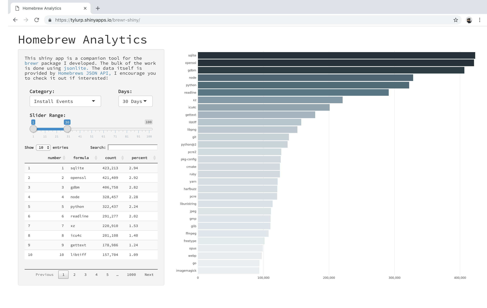

<!-- README.md is generated from README.Rmd. Please edit that file -->

# brewr-shiny

A shiny app for the `brewr` package.



## Running the app

You can view the app [here](https://tylurp.shinyapps.io/brewr-shiny/) or
run it locally. To run it locally, make sure you have the correct
libraries installed (see `app.R`) and then run:

``` r
shiny::runGitHub("brewr-shiny", "tylurp") 
```

Alternatively, you can download this repo, open the project, open
`app.R` and then hit “Run App” in the RStudio IDE.
